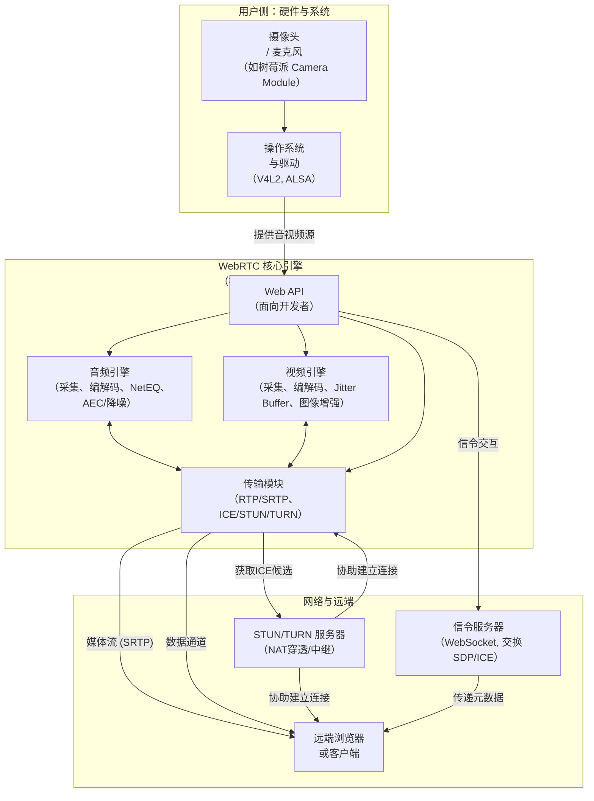

- [Key Concepts](#key-concepts)
  - [典型拓扑](#典型拓扑)
  - [__架构分层__](#架构分层)
    - [__底层（Pion WebRTC 提供）__](#底层pion-webrtc-提供)
      - [Framework](#framework)
    - [__中间层（LiveKit 实现）__](#中间层livekit-实现)
    - [__上层（LiveKit 服务层）__](#上层livekit-服务层)

# Key Concepts

## 典型拓扑
```
┌─────────┐    编码     ┌─────────────┐    转发     ┌─────────┐
│ Client A│───────────>│   LiveKit   │───────────>│ Client B│
│         │  (H.264/   │   (SFU)     │  (H.264/   │         │
│         │   VP8等)    │             │   VP8等)    │         │
└─────────┘            └─────────────┘            └─────────┘
       │                     │                     │
       └─── 解码/渲染 ───────┼─────── 解码/渲染 ───┘
                            │
                    ┌───────┴───────┐
                    │ 仅转发RTP包   │
                    │ 不编解码      │
                    └───────────────┘

```

```
传统 MCU（需要编解码）：
Client A → 编码 → RTP → MCU → 解码 → 混合 → 编码 → RTP → Client B
                    ↑                 ↑                 ↑
                需要CPU          需要CPU          需要CPU

SFU（不需要编解码）：
Client A → 编码 → RTP → SFU → RTP → Client B
                    ↑         ↑
                仅转发      仅转发

```

## __架构分层__

### __底层（Pion WebRTC 提供）__

```javascript
┌─────────────────────────────────────┐
│         WebRTC 协议栈              │
│  • ICE/STUN/TURN 连接建立          │
│  • DTLS-SRTP 加密传输             │
│  • SDP 协商                       │
│  • RTP/RTCP 媒体传输              │
│  • 数据通道（DataChannel）         │
└─────────────────────────────────────┘
```
#### Framework



### __中间层（LiveKit 实现）__

```javascript
┌─────────────────────────────────────┐
│          SFU 核心逻辑              │
│  • 媒体转发决策（Forwarder）       │
│  • 视频层选择（VideoLayerSelector）│
│  • 带宽估计和分配（StreamAllocator）│
│  • 拥塞控制（BWE/Pacer）          │
│  • 房间管理（Room）               │
└─────────────────────────────────────┘
```

### __上层（LiveKit 服务层）__

```javascript
┌─────────────────────────────────────┐
│          应用服务层                │
│  • 房间服务（RoomService）         │
│  • 信令服务（SignalService）       │
│  • 认证授权（AuthService）         │
│  • Webhook 集成                   │
│  • 分布式部署支持                 │
└─────────────────────────────────────┘
```
